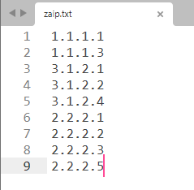
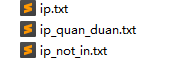
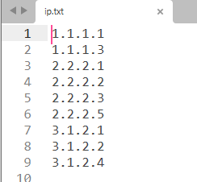
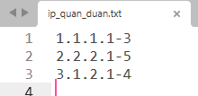
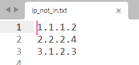

# find\_hide\_ip
# 使用方式
首先将ip资产写入zaip.txt中（无需对ip进行排序）



直接执行python find\_hide\_ip.py，即可对应生成三个文件



ip.txt中写入的是经过排序后的内容



ip\_quan\_duan.txt中写入的是给定的资产的ip段信息



ip\_not\_in.txt中写入的是没有出现在给定的资产列表中，但却在ip段中的ip



可通过该工具在攻防演练中快速探测发现目标单位的薄弱资产。

# 题外话
如果老板觉得工具还可以，也可以请作者喝一杯冰阔乐喔\~


# 免责声明
```Plain Text
    本工具仅面向合法授权的企业安全建设行为，在使用本工具进行检测时，您应确保该行为符合当地的法律法规，并且已经取得了足够的授权。  
    
    如您在使用本工具的过程中存在任何非法行为，您需自行承担相应后果，本人将不承担任何法律及连带责任。 
    
    在使用本工具前，请您务必审慎阅读、充分理解各条款内容，限制、免责条款或者其他涉及您重大权益的条款可能会以加粗、加下划线等形式提示您重点注意。 除非您已充分阅读、完全理解并接受本协议所有条款，否则，请您不要使用本工具。
    
    您的使用行为或者您以其他任何明示或者默示方式表示接受本协议的，即视为您已阅读并同意本协议的约束。
```
